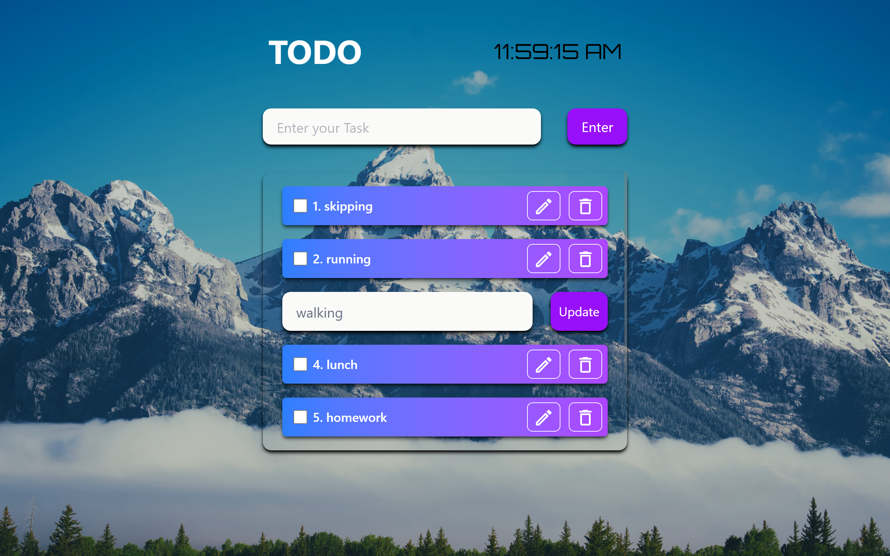
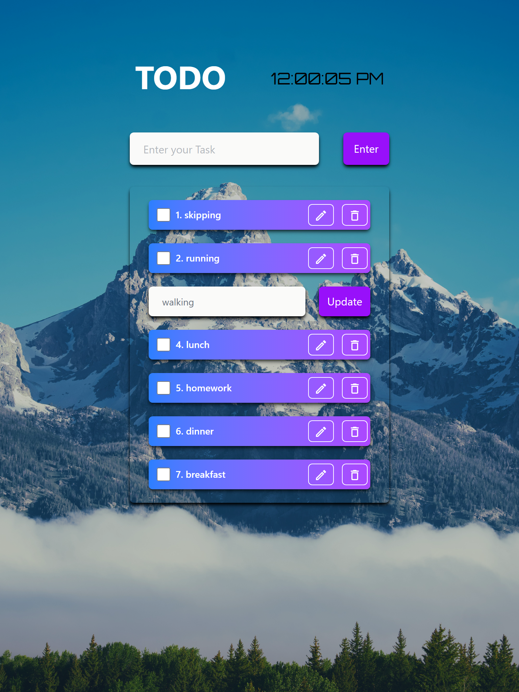
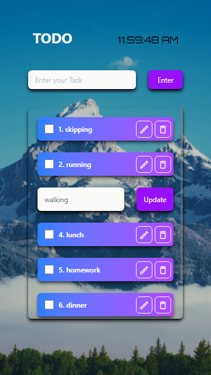

# 📝 Todo App

A modern and responsive Todo Application built with React and Vite. This project allows users to create, edit, complete, and delete tasks while automatically saving data in Local Storage for persistence across browser sessions.

---

# 🚀 Live Demo

🔗 **Live Website:** [live@](https://al-todo.netlify.app/)

---

# 📸 Project Screenshots

## Monitor Screen



---

## Tablet Screen



---

## Mobile Screen



---

# ✨ Features

- Add new tasks
- Edit existing tasks
- Delete tasks
- Mark tasks as completed
- Real-time clock display
- Local Storage persistence
- Responsive design
- Clean and modern UI
- Fast performance with Vite

---

# 🛠️ Tech Stack

## Frontend

- React.js
- Vite
- Tailwind CSS
- Material UI Icons

---

# 📂 Folder Structure

```bash
todo_app/
│
├── public/
│
├── src/
│   ├── components/
│   │   ├── Cards.jsx
│   │   ├── Todo_form.jsx
│   │   └── UpdateFormTodo.jsx
│   │
│   ├── App.jsx
│   ├── main.jsx
│   └── index.css
│
├── package.json
├── vite.config.js
└── README.md
```

---

# ⚙️ Installation & Setup

## 1️⃣ Clone Repository

```bash
git clone https://github.com/AljuSabu/todo_app
```

---

## 2️⃣ Navigate to Project Folder

```bash
cd todo_app
```

---

## 3️⃣ Install Dependencies

```bash
npm install
```

---

## 4️⃣ Run Development Server

```bash
npm run dev
```

---

## 5️⃣ Build For Production

```bash
npm run build
```

---

# 💾 Local Storage Functionality

The application automatically stores tasks in the browser's Local Storage.

Features:

- Data persists after page refresh
- No backend required
- Instant updates

Stored Data Structure:

```json
{
  "id": 1,
  "task": "Learn React",
  "status": false
}
```

---

# 📱 Responsive Design

Optimized for:

- Mobile Devices
- Tablets
- Laptops
- Desktop Screens

---

# 🎨 UI Highlights

- Full-screen background image
- Modern glassmorphism-inspired layout
- Live digital clock
- Smooth user experience
- Clean task management interface

---

# 📌 Future Improvements

- Task categories
- Due dates
- Drag-and-drop task sorting
- Dark/Light theme toggle
- Search functionality
- Task filtering
- Backend integration
- User authentication

---

# 👨‍💻 Author

## Alju Sabu

- GitHub: https://github.com/AljuSabu

---

# ⭐ Support

If you found this project useful, consider giving it a ⭐ on GitHub.
